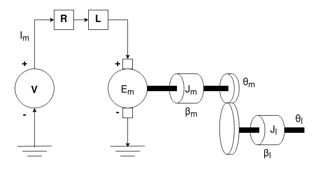
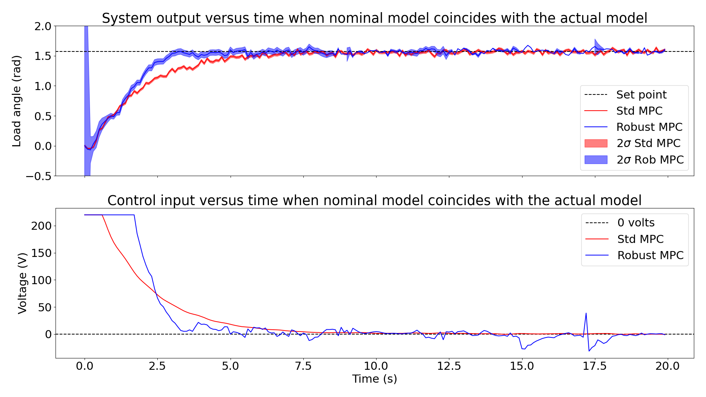
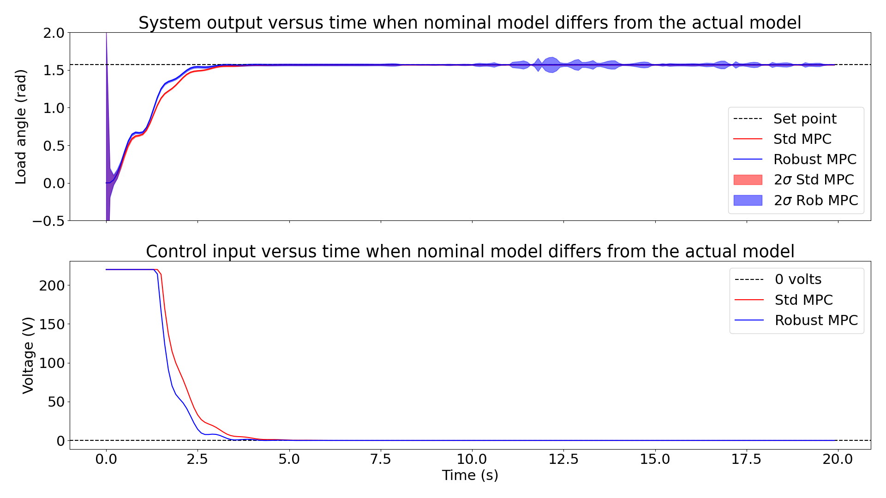

# Robust-MPC

## Description
Implementation of a robust unconstrained model predictive controller that takes into account modelling errors that occur when trying to approximate a complex system with a simple tractable system. The main difference of this variant compared to a vanilla unconstrained model predictive controller is that it uses the robust kalman filter that performs state estimation with the knowledge that the model we are working with is only an approximation. The MPC was applied to a set-point tracking problem in a servo-mechanical system.

**Servo-mechanical system:**



  
## Getting Started

### Installing
```
  git clone https://github.com/Aaatresh/Robust-MPC
```

### Simulating the linear (simple) and complex dynamics
Run files ```code/sim_dyn_lin_model.py``` and ```code/sim_dyn_adv_model.py``` to visualize the simulations of linear and complex dynamics respectively.

### Running the controllers on the simulated dynamics
- **When the approximated linear dynamics (nominal) and the actual complex dynamics agree:** Run files ```code/vanilla_mpc_lin_dyn.py``` and ```code/robust_mpc_lin_dyn.py``` to compare the performance of the vanilla unconstrained MPC and the robust unconstrained MPC.
- **When the approximated linear dynamics (nominal) differs from the actual complex dynamics:** Run files ```code/vanilla_mpc_adv_dyn.py``` and ```code/robust_mpc_adv_dyn.py``` to compare the performance of the vanilla unconstrained MPC and the robust unconstrained MPC.

## Results
- Plots of the output and input of the system when the approximated linear dynamics (nominal) and the actual complex dynamics agree:

- Plots of the output and input of the system when the approximated linear dynamics (nominal) differs from the actual complex dynamics:



## Authors
Contributors' names and contact info:
* Anirudh Aatresh (aaatresh@umich.edu)  

## Version History
* 0.1
    * Initial Release

## License
This project is licensed under the MIT License - see the LICENSE.md file for details.

## References
* [On the coupling of model predictive controland robust Kalman filtering](https://ietresearch.onlinelibrary.wiley.com/doi/epdf/10.1049/iet-cta.2017.1074)
